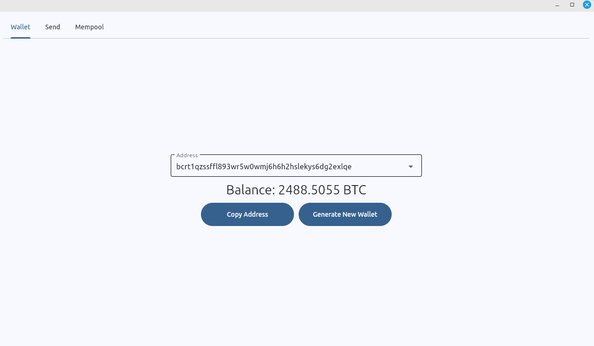
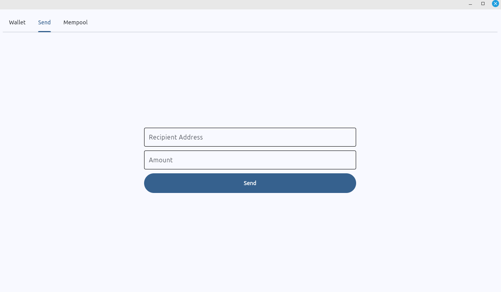
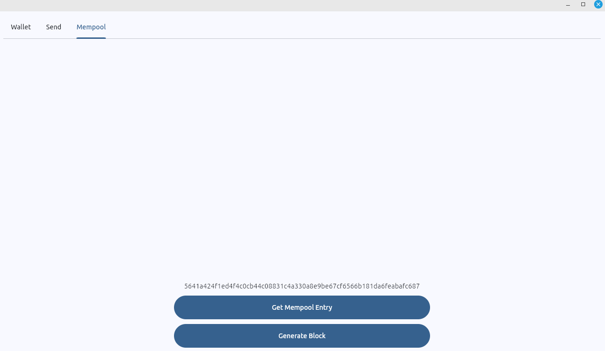

Bitcoin Wallet
===========================


A Bitcoin wallet in Python that allows generating multiple addresses, checking balances, and sending transactions using a Bitcoin Core node API.





## Prerequisites

Before you begin, make sure you meet the following requirements:

- [Python 3+](https://www.python.org/downloads/)

## How to run

```
git clone https://github.com/Luan-Web3/bitcoin-wallet-desktop.git
```

```
cd bitcoin-wallet-desktop
```

- Duplicate the `.env.template` file and rename it to `.env`
```
python3 -m venv .venv
```

```
source .venv/bin/activate
```

```
pip install -r requirements.txt
```

```
python3 src/main.py
```

## License

<sup>
Licensed under either of <a href="LICENSE-APACHE">Apache License, Version
2.0</a> or <a href="LICENSE-MIT">MIT license</a> at your option.
</sup>

<br>

<sub>
Unless you explicitly state otherwise, any contribution intentionally submitted
for inclusion in this crate by you, as defined in the Apache-2.0 license, shall
be dual licensed as above, without any additional terms or conditions.
</sub>